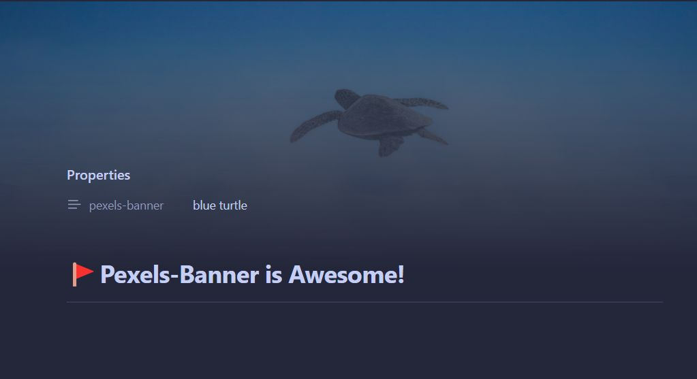

# 🚩 Pexels Banner for Obsidian

Pexels Banner is a plugin for Obsidian that allows you to automatically add beautiful banner images to your notes using the Pexels API, direct URLs, or folder-specific settings. Enhance your note-taking experience with visually appealing headers that provide context and improve the overall aesthetics of your notes.

## Features

- Automatically fetch and display banner images from Pexels based on keywords
- Use direct URLs for custom images
- Use local images from your vault
- Use Obsidian internal links to images
- Set folder-specific default banner images
- Customize image size and orientation
- Set default keywords for when no specific keyword is provided
- Adjust vertical position of the banner image globally, per folder, or per note
- Customize frontmatter field names for banner and Y-position
- Seamless integration with Obsidian's interface

## Installation

1. Open Obsidian and go to Settings
2. Navigate to Community Plugins and disable Safe Mode
3. Click on Browse and search for "Pexels Banner"
4. Install the plugin and enable it

## Usage

1. Obtain a free API key from [Pexels](https://www.pexels.com/api/)
2. In Obsidian, go to Settings > Pexels Banner and enter your API key
3. In any note, add a `pexels-banner` field to the frontmatter with keywords for the desired image, a direct URL, a path to a local image, or an Obsidian internal link:

```yaml
---
pexels-banner: blue turtle
---

# Or use a direct URL:

---
pexels-banner: https://example.com/image.jpg
---

# Or use a local image:

---
pexels-banner: /path/to/local/image.jpg
---

# Or use an Obsidian internal link:

---
pexels-banner: [[path/to/internal/image.jpg]]
---

# Specify a custom y-position for the image (0-100) and content start position (in pixels):

---
pexels-banner: nature
pexels-banner-y-position: 30
content-start-position: 90
---
```

### Folder-Specific Banners

You can set default banner images for entire folders:

1. Go to Settings > Pexels Banner
2. Scroll down to the "Folder Images" section
3. Click "Add Folder Image"
4. Enter the folder path, image URL or keyword, and Y-position
5. Repeat for additional folders as needed

Folder-specific settings will apply to all notes in that folder (and subfolders) that don't have their own banner specified in the frontmatter.

## Configuration

In the plugin settings, you can customize:

- Image size (small, medium, large)
- Image orientation (landscape, portrait, square)
- Number of images to fetch (1-50)
- Default keywords for when no specific keyword is provided
- Global y-position of the banner image (0-100)
- Custom field names for banner and Y-position in frontmatter
- Folder-specific default banner images

The global y-position can be overridden on a per-note basis using the `pexels-banner-y-position` frontmatter field (or your custom field name).

### Custom Field Names

You can customize the frontmatter field names used for the banner and Y-position:

1. Go to Settings > Pexels Banner
2. Scroll down to the "Custom Field Names" section
3. Enter your preferred field names for the banner and Y-position
4. Use these custom field names in your frontmatter instead of the default ones

For example, if you set the custom banner field name to "my-banner" and the custom Y-position field name to "my-y-pos", your frontmatter would look like this:

```yaml
---
my-banner: sunset
my-y-pos: 60
---
```

### Content Start Position

You can set a custom start position for the content below the banner image:

1. Go to Settings > Pexels Banner
2. Scroll down to the "Content Start Position" section
3. Enter a value (in pixels) to adjust where the content starts below the banner
4. This setting can be overridden on a per-note basis using the `content-start-position` frontmatter field

For example, to set a custom start position in your frontmatter:

```yaml
---
pexels-banner: nature
content-start-position: 100
---
```

## Example Note Screenshot



## Feedback and Support

If you encounter any issues or have suggestions for improvements, please [open an issue](https://github.com/jparkerweb/pexels-banner/issues) on the GitHub repository.

## Credits

This plugin uses the [Pexels API](https://www.pexels.com/api/) to fetch images. Special thanks to Pexels for providing this service.
